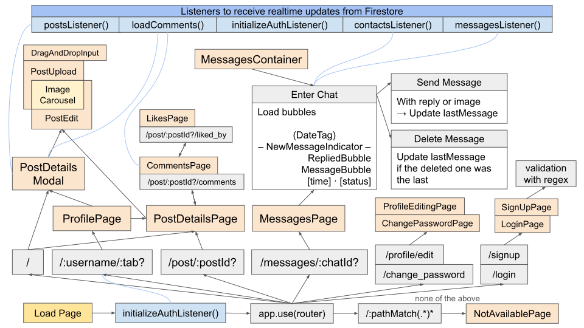
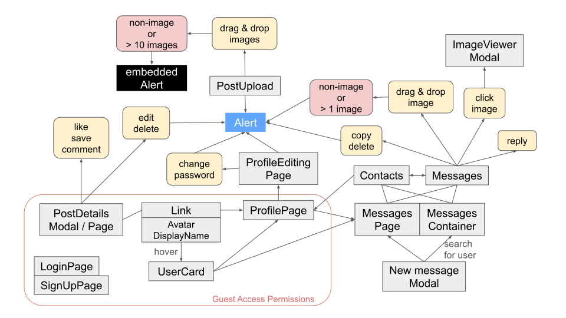

# Instaparody

An Instagram clone integrated with a clone of Twitter's direct messages

## Overview

Create posts with attached photos, and like, save, or comment on them, just like on Instagram, and send private messages to your contacts, just as on Twitter.


### Live demo: https://instaparody.vercel.app/

The demo accounts:

```
demo_01@email.com
demo_02@email.com
demo_03@email.com
```

The password for each account:

```
00000000
```

or register with an email address without the need for verification.

## Features

#### Drag and drop photos to include them in your post


#### Edit or delete your posts


#### Like, save, or leave comments on any post


#### Make contact with other users through their posts, profile page, or by searching for them


#### Drag and drop a photo to send it with a message to your contacts


#### Customize your profile by adding a profile photo, updating your introduction, and selecting your preferences


#### Others

- All pages and modals are designed to be responsive across all screen sizes. Squeeze them as you like.
- The subscript under each message you send indicates whether it has been sent or seen by your contact.
- The alert lasts a few seconds to inform users what was done in success or inappropriately.

## Technique

### Core

- Vue 3
- Vue Router
- Pinia

### Appearance

- Tailwind CSS
- Font Awesome

### Backend Database

#### Firebase 10

- Firestore
- Storage
- Authentication

### Hosting

Vercel

### Build tool

Vite

### Procedure Flowchart



### User Experience



### Firestore Database Schema


### Directory Structure

<details>
<summary>Expand</summary>

```
src
│  App.vue
│  main.js
│  routes.js
│  style.css
│
├─assets
│  │  base.css
│  │  vue.svg
│  │
│  └─icons
│     sprite.svg
│
├─components
│  │  AvatarLink.vue
│  │  CommentInput.vue
│  │  CommentsList.vue
│  │  ConfirmModal.vue
│  │  DisplayNameLink.vue
│  │  ImageCarousel.vue
│  │  LikesList.vue
│  │  Logo.vue
│  │  NavBar.vue
│  │  NoSuchPost.vue
│  │  PostDetails.vue
│  │  PostImageItem.vue
│  │  PostImageList.vue
│  │  PostItem.vue
│  │  PostItemLoader.vue
│  │  PostList.vue
│  │  Search.vue
│  │  SearchMobile.vue
│  │  SearchResults.vue
│  │  TheAvatar.vue
│  │  TheButton.vue
│  │  TheFooter.vue
│  │  TheIcon.vue
│  │  TheLabel.vue
│  │  TheLayout.vue
│  │  TheModal.vue
│  │  TheTooltip.vue
│  │  UserCard.vue
│  │  UserInfo.vue
│  │  UserPlate.vue
│  │  UserSkeletonLoader.vue
│  │
│  ├─Alert
│  │      Alert.vue
│  │      AlertContent.vue
│  │
│  ├─Messages
│  │      Chat.vue
│  │      ConfirmDeleteMessage.vue
│  │      Contacts.vue
│  │      ContainerTab.vue
│  │      DateTag.vue
│  │      DeleteButton.vue
│  │      EmojiPicker.vue
│  │      ImagePreview.vue
│  │      ImageViewer.vue
│  │      MessageBubble.vue
│  │      MessageContent.vue
│  │      MessageDragAndDrop.vue
│  │      MessageInput.vue
│  │      Messages.vue
│  │      MessagesContainer.vue
│  │      MoreButton.vue
│  │      MoreMenu.vue
│  │      NewMessageIndicator.vue
│  │      RepliedBubble.vue
│  │      ReplyPreview.vue
│  │      SearchPeople.vue
│  │      TobottomButton.vue
│  │
│  ├─NavBar
│  │      LoginButton.vue
│  │      NavBarMobile.vue
│  │      NavBarSliding.vue
│  │      ProfileIconMenu.vue
│  │
│  ├─PostButtons
│  │      CommentButton.vue
│  │      ConfirmDeleteOrDiscard.vue
│  │      LikeButton.vue
│  │      LikesCountBanner.vue
│  │      PostEdit.vue
│  │      postMoreButton.vue
│  │      postMoreMenu.vue
│  │      SaveButton.vue
│  │      TimeBanner.vue
│  │
│  ├─PostUpload
│  │      AlertBanner.vue
│  │      ConfirmDiscardPost.vue
│  │      DragAndDropInput.vue
│  │      InputAlert.vue
│  │      PostUpload.vue
│  │
│  └─ProfileEditing
│          ChangePhoto.vue
│          ChangePhotoMenu.vue
│          DropdownMenu.vue
│          GenderSelect.vue
│          IntroInput.vue
│          TheUploadBtn.vue
│
├─firebase
│      auth.js
│      firebase.js
│      firestore.js
│      storage.js
│
├─modules
│      position.js
│
├─pages
│      ChangePasswordPage.vue
│      CommentsPage.vue
│      HomePage.vue
│      LikesPage.vue
│      LoginPage.vue
│      MessagesPage.vue
│      NotAvailablePage.vue
│      PostDetailsPage.vue
│      ProfileEditingPage.vue
│      ProfilePage.vue
│      SearchPage.vue
│      SignUpPage.vue
│
├─stores
│      alert.js
│      comment.js
│      mediaQuery.js
│      message.js
│      post.js
│      user.js
│
└─utils
        date.js
        request.js
        validation.js
```

</details>

## Credits

[Emoji Mart (Vue)](https://github.com/serebrov/emoji-mart-vue)
